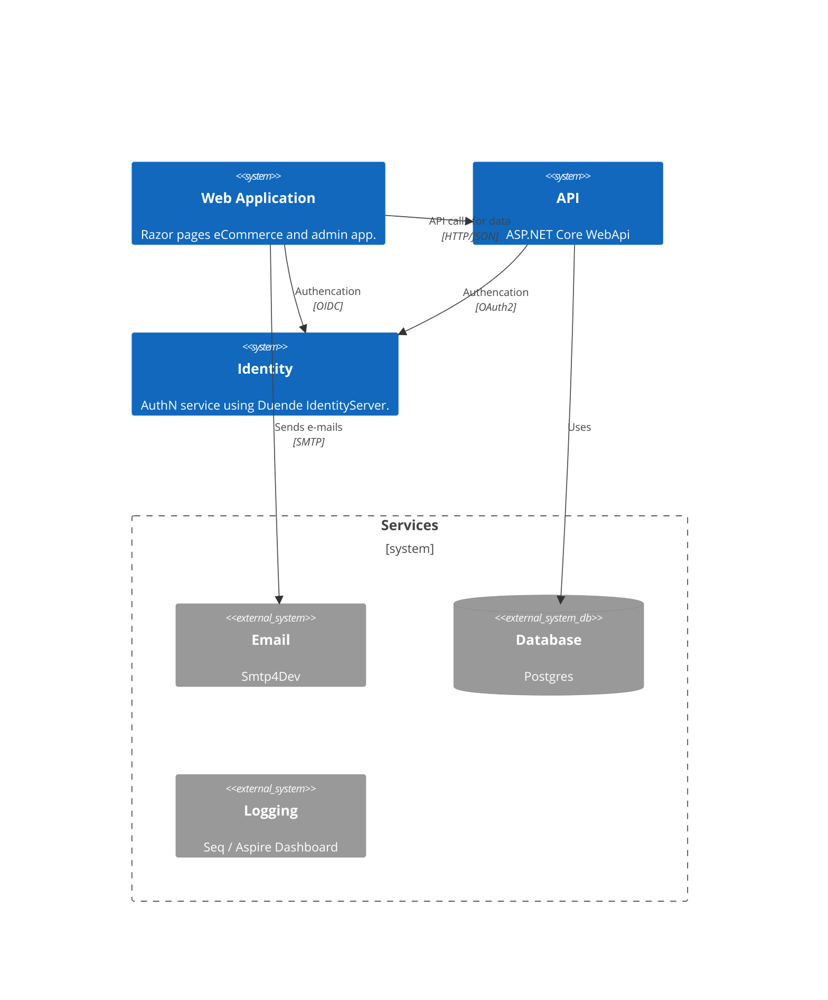

# Cloud Native Development with .NET

This repo will show different approaches to doing development that will target cloud native deployments.

## Solution Overview



## Building Container Images (for CI pipelines)

The easiest way to build container images for the ASP.NET Core
projects is to use `dotnet publish` with the `PublishContainer` option.

This requires that the `csproj` files for the API, WebApp, and Identity
projects have the following properties:

```xml
  <IsPublishable>true</IsPublishable>
  <EnableSdkContainerSupport>true</EnableSdkContainerSupport>
```

To build the container images, you would run a command like the
following from the folder containing the ASP.NET Core project:

```bash
dotnet publish --os linux /t:PublishContainer
```

Optional parameters (use each with `-p name=value` syntax or as
properties in the `csproj` file):

* `ContainerRepository`: Name of the container with namespace or other folders. Examples: `carvedrock/carvedrock-api`, `dahlsailrunner/carvedrock-api`
* `ContainerTag`: Specify a tag for the container image. Nice to use a BuildNumber or something like that.
* `ContainerTags`: Alternative to the `ContainerTag` parameter. Use this to specify multiple tags (separated by `;`) for the container image.
* `ContainerRegistry`: Name for the registry the image will be published to - when provided it will push the image to the specified registry.  **NOTE: You need to be authenticated to the registry with `docker login` somehow when providing this value.**
* `ContainerBaseImage` Specific base image to use when building the container.
* `ContainerFamily`: Specify a family name rather than exact base image (e.g. `alpine`).  Ignored if `ContainerBaseImage` is set.

Example for the API project (run from the `CarvedRock.Api` folder):

```bash
dotnet publish --os linux /t:PublishContainer -p ContainerRepository=dahlsailrunner/carvedrock-api -p ContainerFamily=alpine
```

Here's a second example that would push to a registry after building the image:

```bash
dotnet publish --os linux /t:PublishContainer -p ContainerRegistry=docker.io -p ContainerRepository=dahlsailrunner/carvedrock-api -p ContainerFamily=alpine
```

### Line Separators

In `bash` (linux) terminals, you can use `\` as a line separator:

```bash
dotnet publish --os linux /t:PublishContainer \
  -p ContainerRepository=dahlsailrunner/carvedrock-api \
  -p ContainerFamily=alpine
```

In PowerShell, you can use the backtick (`) as a line separator:

```powershell
dotnet publish --os linux /t:PublishContainer `
  -p ContainerRepository=dahlsailrunner/carvedrock-api `
  -p ContainerFamily=alpine
```

### Pipeline YAML

Here is a YAML task that you could use in an Azure DevOps pipeline
to build and publish a container image:

```yaml
- task: DotNetCoreCLI@2
  displayName: 'Publish container image'
  inputs:
    command: 'publish'    
    arguments: >-
      --os linux 
      --arch x64 
      /t:PublishContainer 
      -p ContainerRegistry=registry.yourcompany.com 
      -p ContainerRepository=yourteam/carvedrock-api
      -p ContainerImageTag=$(Build.BuildId)
  env:
    SDK_CONTAINER_REGISTRY_UNAME: 'svc_account_for_pipelines'
    SDK_CONTAINER_REGISTRY_PWORD: $(DOCKER_PASSWORD)
```

#### More Information

* [Publishing container images](https://learn.microsoft.com/en-us/dotnet/core/docker/publish-as-container?pivots=dotnet-8-0#publish-net-app): Includes information about all of the different parameters you can use
* [.NET Container images](https://learn.microsoft.com/en-us/dotnet/core/docker/container-images): More about the different images that are available for various scenarios
* [ASP.NET Core Full Tag Listing](https://mcr.microsoft.com/product/dotnet/aspnet/tags): Listing of all the different base images available for ASP.NET Core

### Using the Docker CLI

I find that the SDK-based approach (`dotnet publish`) is easier and I like the simplicity
of not needing any of the Docker-related files in the repo.  But this may not be the approach
you want to take, for any number of reasons.

If you want to use `docker build` to build container images,
you would need to include a `Dockerfile` in each project folder
for the ASP.NET Core projects, plus a `.dockerignore` file
in the root of the solution.

The Dockerfile would specify the base image that you would
use to build the image.  See the `Dockerfile` in
the `containers/CarvedRock.Api` as an example.

The commands to build and push the API container image are as follows and should be
run from the `containers` folder.

```bash
docker build -t dahlsailrunner/carved-rock-api -f CarvedRock.Api/Dockerfile .

docker push dahlsailrunner/carved-rock-api  # will go to docker.io (assuming you're logged in)
```

Pushing this image to a container registry with a single `build` command can be done
by adding the `--push` argument.  Note that the default registry is `docker.io`.
To use a different registry all from this single command add the registry to the
beginning of the tag name.  For example:

```bash
docker build --push -t registry.mycompany.com/dahlsailrunner/carved-rock-api -f CarvedRock.Api/Dockerfile .
```

Note that you need to have already done a `docker login` to any registry you're pushing to.
